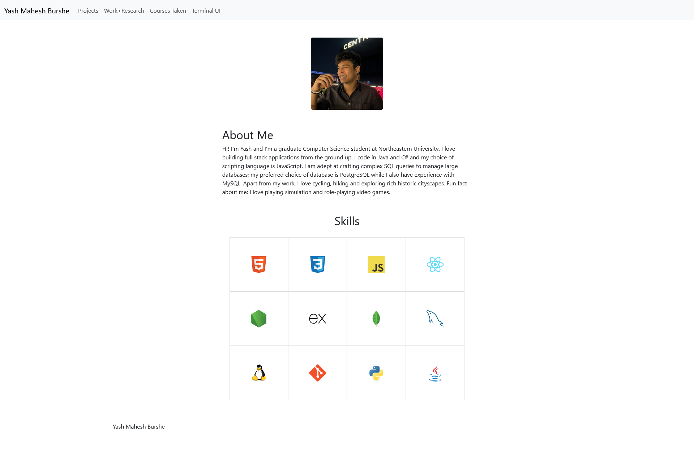
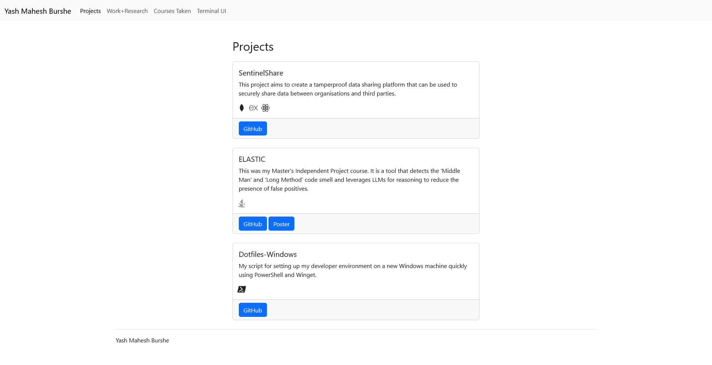
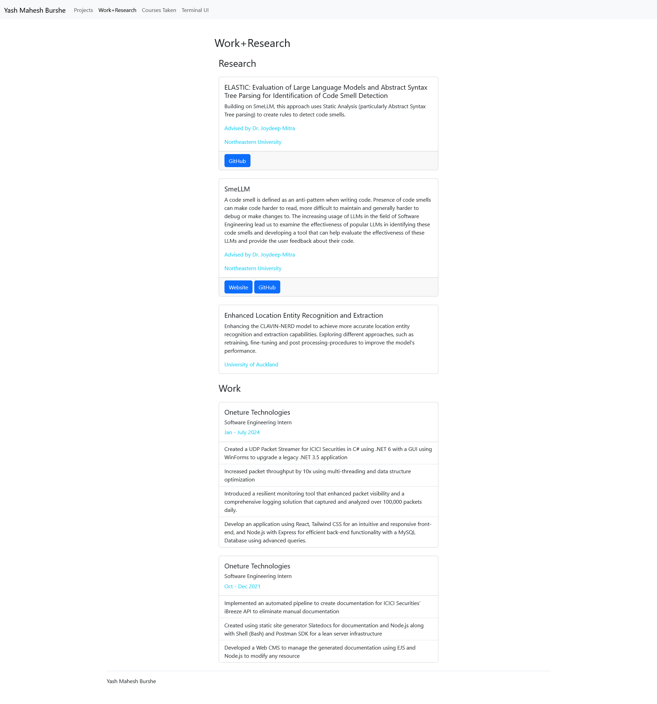
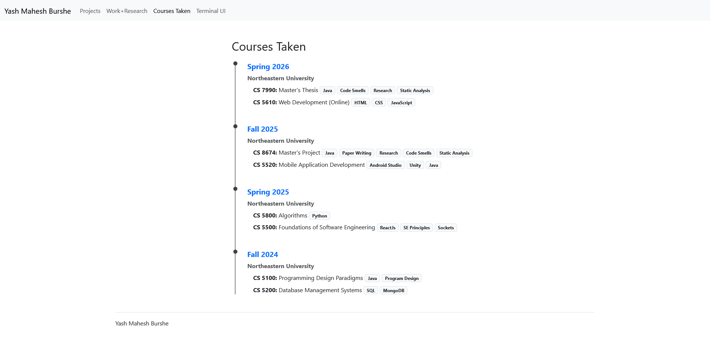

# Personal Website

## Author
Yash Mahesh Burshe

## Class Link

https://johnguerra.co/classes/webDevelopment_online_spring_2026/

## Project Objective

To create a website using HTML, CSS and JavaScript along with Bootstrap for my personal homepage.

## Design Document

https://docs.google.com/document/d/1D6e1yzrltWENoX6iGHmThvqGseVcnRRYkQbc8fTkJ1o/edit?usp=sharing

## Screenshots

### index.html

### projects.html

### work-research.html

### courses-taken.html

### terminal-ui.html

## Instructions to build

1. run `npm install`
2. run `npx http-server`
3. The website will be live at the link in the terminal generated by the `http-server` package.

## AI Generated page

### LLM Used
Gemini 3 Pro

### Prompt
You are an expert web developer. Write a website page in HTML, CSS and JavaScript that acts as a terminal. As a user of this website, I should be able to type in basic commands like cat, ls and help and see the output. The output is based on my portfolio. The information for the printing of the commands should be stored in a JSON for easy manipulation. The directories will be ./projects, ./work, ./research, ./about, ./courses-taken, and inside each directory will be items in .txt corresponding to the directory. This will all be stored inside JSON files. Make the page look like a terminal as well. Separate the JSON data into a separate file and use AJAX to retrieve it. Separate the CSS, HTML and JS into different files. Add a 'back' command as well which redirects to index.html

### Files added by LLM:

`css/terminal-style.css`

`js/terminal.js`

`terminal-ui.html`